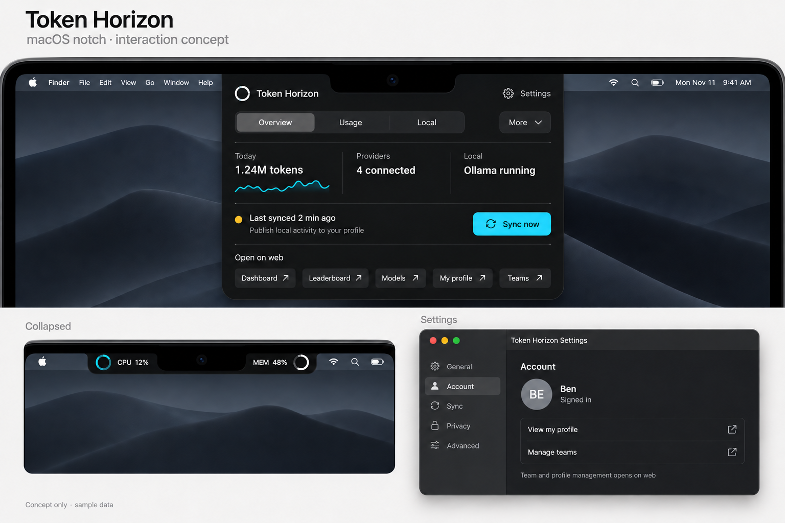
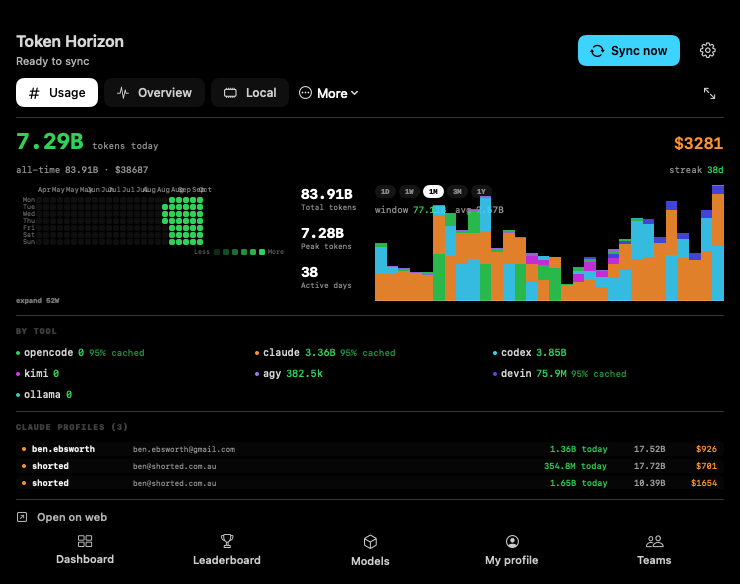
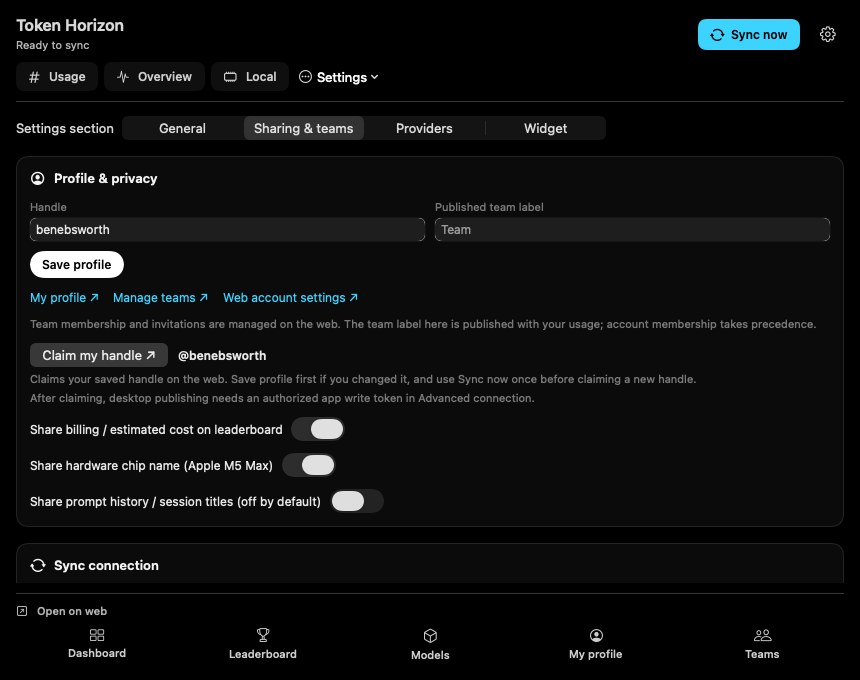
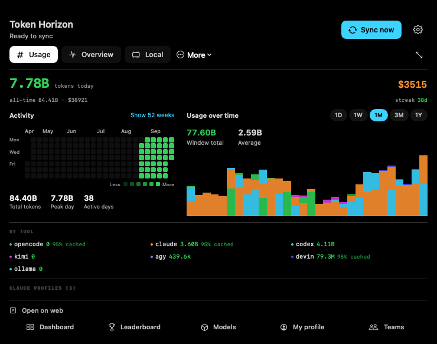

# macOS flow review

Reviewed and implemented on 1 October 2026. The scope is the native app's notch, menu-bar popover, dashboard window, browser navigation, settings, and leaderboard sync. Existing website changes were left in place.

| Flow | Previous friction | Implemented behavior |
| --- | --- | --- |
| Notch navigation | Nine tiny tabs, mostly unlabeled icons; quit beside navigation | Usage, Overview, Local, and Settings have visible labels. More contains advanced local tools and Quit. The selected quick tab survives closing the notch. |
| Main web UI | One hardcoded leaderboard link buried in a configuration drawer | Persistent labeled links open Dashboard, Leaderboard, Models, My profile, and Teams. Browser links share one validated route builder and honor custom deployments. |
| Settings | Duplicated leaderboard configuration; widget settings precede general preferences | The Settings tab, gear, and Command-comma open inline settings on the current surface. General, Sharing & teams, Providers, and Widget divide settings into four sections. Popout carries the selected section to the native window. |
| Sync | Publish, local-only Sync, Push, Pull, and another Settings Publish control | One Sync now action in the shared header collects fresh engine usage/history/heatmap, stages the private-filtered local entry, publishes, then pulls rankings. All surfaces observe one running state. |
| Automatic sync | Unconfigured default URL made the toggle appear enabled while doing nothing; repeated error retries | The toggle shows the effective state. Explicitly enabling it configures the default cloud connection when needed. Existing TTL/change gates remain; errors receive a 30-second retry delay. Manual sync bypasses that delay. |
| Sync feedback | Some errors swallowed; publishing finished before rankings | Loading lasts through the entire operation. Failed publication and successful rankings refresh are reported as a partial failure. Read-only Sheets reports that publishing is unavailable. Last successful completion is retained after failures. |
| Anonymous profiles | Newly issued claim tokens discarded; later publishes could fail | Issued credentials are saved privately for the exact deployment endpoint and handle, and reused on subsequent publishes. A secure recovery field accepts an existing original claim token. Cloud publish redirects are refused. |
| Teams | Editable team text implied membership management | The field is labeled Published team label. Manage teams opens the existing web team flow, where membership and invitations are handled. |

## Destinations

- Dashboard: `/leaderboard?view=dashboard`, allowing the browser account to discover its owned profiles.
- Leaderboard: `/leaderboard`.
- Models: canonical `/models`.
- My profile: `/u/<encoded local handle>`, using the same effective identity as local publication.
- Teams: `/leaderboard?view=teams`.
- Web account settings: `/leaderboard?view=settings`.
- Sign in: `/leaderboard?view=dashboard&signin=1`, preserving the existing sign-in continuation.

Browser sign-in and native publishing credentials remain separate. Claimed profiles still require an authorized app write token. `/connect` manages MCP application grants and is not used as desktop sync setup. Prompt/session titles remain private by default.

The popout action carries its selected native tab. Existing widget links continue to work; `tokenhorizon://settings` and `tokenhorizon://dashboard?tab=settings&section=Sharing%20%26%20teams` also route into settings.

## Claim and widget actions

Sharing & teams now offers **Claim my handle** for the effective saved local handle. It opens the existing browser claim modal with `?view=players&user=<handle>&claim=1`, waits for account restoration, and resumes the claim dialog after sign-in. Opening this link never claims automatically and never places an anonymous claim token in a URL. New handles must be published with Sync now before they can be claimed.

The new direct-dialog entry is implemented and browser-tested locally; deployment to the public website requires approval. Until that web change is deployed, the installed native action opens the profile, where the existing **Claim profile** action starts the same flow. A validated [claim-only web patch](claim-web-only.patch) contains 32 additions and 7 removals against commit `17534fb`, excluding concurrent teams, CSS, and 3D changes. The browser regression passed again against the latest shared source.

Claiming associates the profile with a verified web account. The existing server then requires a verified owner session or authorized app write token for future publication; a saved anonymous claim token no longer authorizes the Mac's writes. This is explained alongside the native action and in the web confirmation. Browser Sign in remains separate from native sync authorization.

All widget sizes have **Sync now** and **Sign in** links, including paused, empty, stale, and offline states. Sync opens the native Usage dashboard and invokes the same shared operation, showing progress and failures there; completion requests a fresh widget timeline. Sign in opens the browser account login. Existing page/window links and snapshot schema v5 remain intact.

Small and medium content adapts to the available height so the actions do not crowd the header or spill outside the card. The extension's future stale timeline entry retains the selected page and time window.

The widget uses `Link` controls, following [Apple's current widget deep-link guidance](https://developer.apple.com/documentation/widgetkit/linking-to-specific-app-scenes-from-your-widget-or-live-activity), and retains the whole-widget Dashboard fallback. App Intents are not used because taps are not delivered for this extension's ad-hoc signing.

Native widget renders: [small, 170 × 170](native-widget-small-preview.png), [medium, 360 × 170](native-widget-medium-preview.png), and [large, 360 × 340](native-widget-large-preview.png). All five medium chart windows, limits/plans pages, and offline/paused small states were also captured. These are actual SwiftUI renders, rather than running WidgetKit screenshots; live WidgetKit tap delivery was not exercised. A harmless Settings deep link was verified against the installed app through LaunchServices.

## Visual concept

This image was generated with the built-in imagegen tool and contains illustrative data. It shows the desired hierarchy, camera-safe notch shape, labeled browser actions, and separate settings surface. The shipped SwiftUI chrome follows that hierarchy; its existing detailed usage and local-tool views are retained. The native settings implementation uses a four-section picker rather than the concept image's sidebar.

Exact generation instructions are saved in [the original prompt](notch-concept-prompt.txt) and [the final edit prompt](notch-concept-edit-prompt.txt). The final edit removed an unsolicited slogan.

## Verification

- Native target compiled successfully during focused testing.
- 51 relevant XCTest cases passed: sync coordination (15), cloud credentials (6), web destinations (7), existing sync policy/merge (9), notch geometry (1), and existing leaderboard/settings regressions (13). These include prompt privacy.
- The claim/widget follow-up passed 47 related permanent tests plus a temporary native render test. The final widget view revision passed another focused run of 21 related tests and the capture test. Snapshot generation measured 1.00 ms against its 5 ms budget. Temporary render sources were removed.
- `node scripts/test-profile-ui.mjs` passed, including signed-out Google continuation, remembered-account/unpublished-handle recovery, GitHub return with an unusual handle, and explicit claim confirmation with no credential in the URL. Browser API calls were fixture-intercepted.
- New controller and routing/credential files have no SwiftLint errors; integration files retain existing warnings and have no lint errors.
- `git diff --check` passed.
- The full sandboxed suite failed existing `DurableStoreTests.testDurableStore_historyRoundTrip` and `testDurableStore_limitsRoundTrip`, then stalled in `testDurableStore_resetAll`. These singleton tests reset the real user cache, which the sandbox prevents. The run was stopped; it was not retried with permission to reset that cache.

Tests use injected callbacks for sync and pure URL/credential helpers; they do not publish profiles or contact live provider APIs.

The canonical `scripts/make-app.sh` launcher built, signed, installed, and restarted the app after the margin correction. The serving `/health` response confirmed version `0.3.12`, commit `987afb8-dirty`, and build time `2026-10-01T11:01:31Z`. The subsequent claim/widget build was installed and health-verified as `17534fb-dirty`, built at `2026-10-01T11:38:57Z`, with the app and widget signed and the gateway serving normally.

The new Sharing & teams deep link opened the installed app's real 860-point window. [This screenshot of the running app](running-settings-sharing.png) confirms the Claim my handle entry and repaired horizontal margins. No live sync, sign-in, or claim was triggered during validation.

## Margin correction and native renders

The initial 640-point notch width could not contain the existing Plan Limits table: its columns, gaps, and row padding need 668 points, or 700 points including the notch's side margins. SwiftUI expanded the whole root beyond the panel, clipping the header and web shortcuts as well as body content.

The expanded notch is restored to 740 points. The root is explicitly sized to the hosting view's measured bounds, the By tool summary wraps into an adaptive grid, and the popover/window have the same width floor. These changes preserve the 16-point horizontal content margins. Geometry and formatting checks passed after the correction.

These previews were rendered from the actual SwiftUI views with cached data covering seven tools and three Claude accounts. They are native rendered previews, not screenshots of the running app. The temporary capture test passed and was removed.

Both renders fit their horizontal margins. Settings content scrolls above the pinned browser footer. A separate fresh visual review checked the repaired surfaces against the reported clipping screenshot and confirmed the header, controls, footer, costs, and visible account table fit. The Plan Limits table is below the captured viewport; its width was checked from the fixed column sizes and host geometry. Still renders do not verify live hover/menu interactions. The subsequent chart correction is documented below.

## Responsive notch and chart correction

The reported window/average caption overlap came from scaling each provider separately and then stacking the results. Four equal providers created a 152-point stack inside an 80-point plot. Each bucket now receives one bounded total height, divided proportionally among its providers. The plot has its own clip, while hover details stay inside the plot's width and height. Missing provider breakdown is rendered as Other; this presentation change does not alter engine token accounting.

The calendar and trend plot use available width to choose their layout. The normal 24-week calendar stays on the left with at least 360 points for trends. At the 740-point notch width, the expanded 52-week calendar moves below the full-width plot. Window totals and averages have their own row above the bars; larger labels and a horizontal calendar summary keep the hierarchy readable. Browser shortcuts use a compact single-row label, and long account names truncate inside their column without moving numeric totals. Full sync errors remain readable in Sharing & teams while the header shows at most two lines.

The calendar aligns weeks to Monday, retains gaps in history, and labels each month once. Custom hover details are retained because native help does not fire in the nonactivating panel; the bubble is bounded to the calendar's actual width. Display changes refresh the panel's screen and hosted geometry together. Height adapts to short or scaled displays with clearance above the dock, while the 740-point width floor and 16-point side margins remain. Panel, gauge, and calendar animations honour Reduce Motion.

Six native renders cover all five windows, seven mixed providers, long account labels, three widths, and an expanded year calendar. A separate review found no material layout issue. These are offscreen SwiftUI renders; live notch interaction is checked separately where available.

[Expanded 52-week calendar at 740 points](responsive-usage/native-usage-expanded-52w-740.png), [long account labels at 860 points](responsive-usage/native-usage-mixed-long-handles-860-1w.png), and [90-day chart at 1100 points](responsive-usage/native-usage-mixed-long-handles-1100-3m.png) show the responsive layouts. The remaining captures cover 1D and 1Y at 740 points.

The final confirm passed 24 focused tests: 8 chart/calendar checks, 9 stack-layout checks, 6 display geometry checks, and 1 temporary native capture. The 23 permanent tests include many-provider overflow, missing/overreported breakdown, invalid heights, extreme integer values, Monday alignment, missing weeks, month/year boundaries, tooltip edges, notch coordinates, and dock clearance. The temporary capture source was removed. SwiftLint reports no errors in the changed UI/test files; existing warnings remain. `git diff --check` passes.

The canonical launcher built, signed, installed, and restarted version `0.3.12`, commit `9cc7bb1-dirty`, built at `2026-10-01T12:20:10Z`. `/health` confirmed that stamp and gateway port `11436`. The repository's `task smoke` passed every check, including usage, trends, limits, catalogs, heatmap, widget v5, project/achievement data, gateway config/traces, and MCP tools.

The [running notch screenshot](responsive-usage/running-notch-responsive.png) shows the installed app at 740 × 592 logical points, with captions and side margins intact. A [live heatmap hover screenshot](responsive-usage/running-notch-heatmap-hover.png) confirms custom tooltip delivery inside the calendar's bounds. The pointer was restored after both captures. Physical display switching, menu tracking, and WidgetKit tap delivery were not exercised in this final pass; display geometry was checked through the pure tests.

## Settings and dismissal follow-up

The [2 October interaction/performance review](interaction-performance/README.md) adds Settings directly to the notch, a visible Close control, recovery from stale menu tracking, preserved Settings drafts, and bounded background collection. It includes four-section native renders, a short-panel capture, focused test results, and runtime verification.
