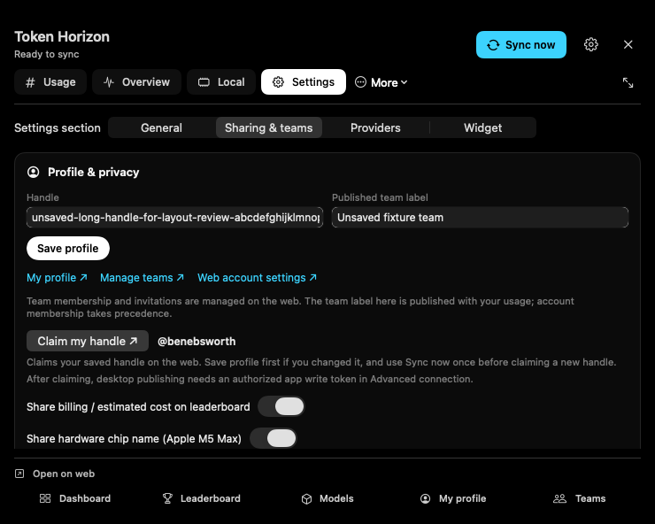

# Notch Settings, dismissal, and refresh performance

Reviewed on 2 October 2026. This follow-up addresses the reported panel that stayed open and the request to expose Settings inside the notch. It preserves the 740-point width floor and 16-point content gutters from the earlier margin repair.

## Implemented behavior

- Settings is a labeled quick tab alongside Usage, Overview, and Local. The header gear and More → Settings also open the same inline view. General, Sharing & teams, Providers, and Widget stay available inside the panel; the popout carries the selected section into the main window.
- A visible Close button, Escape while the panel receives keyboard input, and outside clicks share one dismissal path. Explicit dismissal requires a fresh pointer entry before reopening.
- Native menus hold the panel open only when initiated by the panel. A missing menu-end notification recovers after AppKit leaves its tracking loop. An active menu remains open without an arbitrary timeout.
- The selected compact Settings section and unsaved text fields survive closing/reopening. Surface changes are deferred and coalesced so a control can finish its event before its host is removed. Toggling the additional tray icon retains the existing notch.
- Heavy refresh requests share one active collector and one pending follow-up. Filesystem bursts no longer create parallel process/Docker collectors. Docker sampling has a three-second collection deadline, deduplicates concurrent callers, and backs off after empty or failed attempts; only its own CLI child can be terminated.
- Local leaderboard preparation, ranking reads, serialization, and disk writes run on a serial utility queue. Settings profile/privacy changes stage local data there without rescanning providers or Docker.
- Settings cache size is read off-main once on entry/after reset. Cache reset releases the durable-store lock before notifying engine observers, removing the reverse lock-order deadlock; the UI no longer sends a second reset notification.

These changes preserve engine locking, usage accounting, prompt privacy, widget deep links and snapshot v5. They add no dependency.

## Evidence and limits

A five-second sample of the previous installed app did not reproduce a sustained main-thread hang: the main thread was in its event loop for 365 of 373 samples. It did catch leaderboard encoding on main and three concurrent Docker waits on utility threads. The close bug and cache-reset lock inversion were found in source. This is evidence for the specific changes above, not a claim of a measured whole-app CPU improvement.

The focused batch passed 56 tests (55 permanent tests and one temporary native capture), with no failures. It covers collector burst/race ownership, Docker caching and process deadlines, panel menu/dismissal policy, display geometry, isolated cache reset, and chart regressions. The reset test uses a private temporary directory and a private notification center; it never resets the user's cache. Sync, sign-in, and cache reset were not invoked against the running app during UI checks.

One capture-only confirm repaired transparent offscreen compositing by adding an opaque black background to the temporary harness; no product source changed. Five actual SwiftUI renders cover all four Settings sections at 740 × 592 points and General at 740 × 420. The short panel scrolls its content above the fixed browser footer. Unsaved text and the selected section survived two close/reopen cycles, and persisted settings bytes were unchanged. The temporary harness was removed.

[General](settings-general-740x592.png), [Providers](settings-providers-740x592.png), [Widget](settings-widget-740x592.png), and [short General panel](settings-general-740x420.png) are native offscreen captures. They verify layout and draft retention, rather than physical hover/menu delivery.

## Installed build

The canonical `scripts/make-app.sh` launcher built, signed, installed, and restarted the app successfully. `/health` confirmed version `0.3.12`, commit `9cc7bb1-dirty`, built at `2026-10-02T09:42:44Z`; gateway port `11436` and Ollama proxy port `11435` were healthy. `task --silent smoke` passed every local API and MCP check.

A comparable five-second sample of the installed app found the main thread sleeping in its event loop for 381 of 385 samples; the remainder was brief SwiftUI/layout work. No collector wait, leaderboard encoding, or cache-size read appeared on main. Collection was observed on the named serial `token-horizon.refresh` queue, with one deadline-bound Docker wait rather than the baseline's three overlapping samplers. Leaderboard staging was too brief to appear in this sample; its background placement is established by the reviewed and compiled source. Both samples were largely idle and are not a whole-app CPU benchmark.

Computer Use could inspect the installed collapsed notch. Its coordinate click/drag attempts did not trigger physical hover, and the collapsed ring accessibility elements exposed no click action. The available API has no hover operation. Live hover, More-menu tracking, and close-button delivery therefore remain unverified in this pass; no alternate event-injection technology was used. The pure dismissal/menu policy tests and native layout/lifecycle captures are the evidence for those behaviors.

`git diff --check` passed. SwiftLint completed without errors across the changed source and tests; 111 style warnings remain. Lint ran with its cache disabled to avoid writing outside the workspace.
