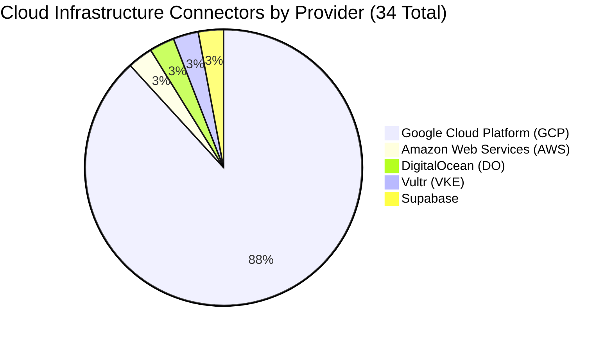
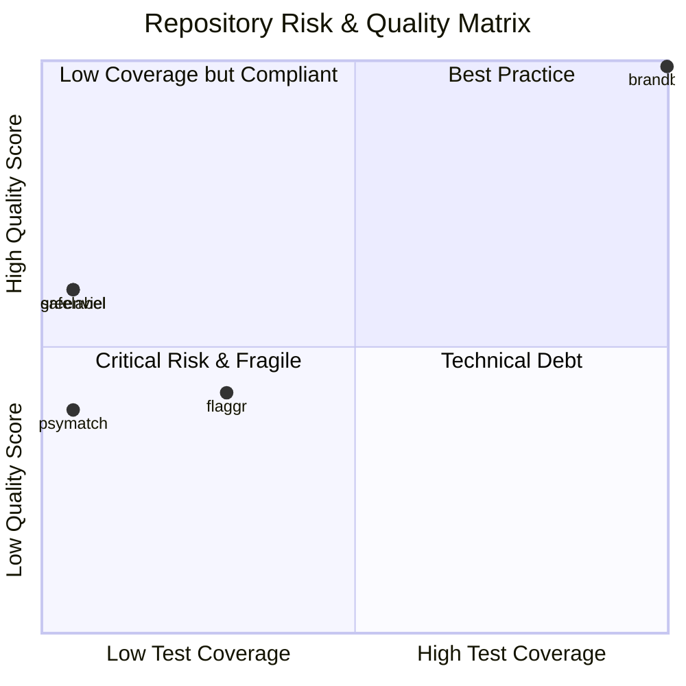
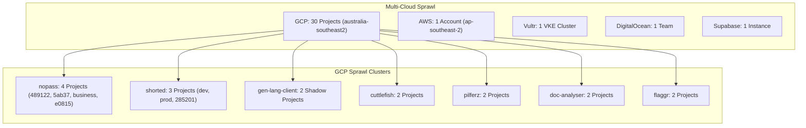
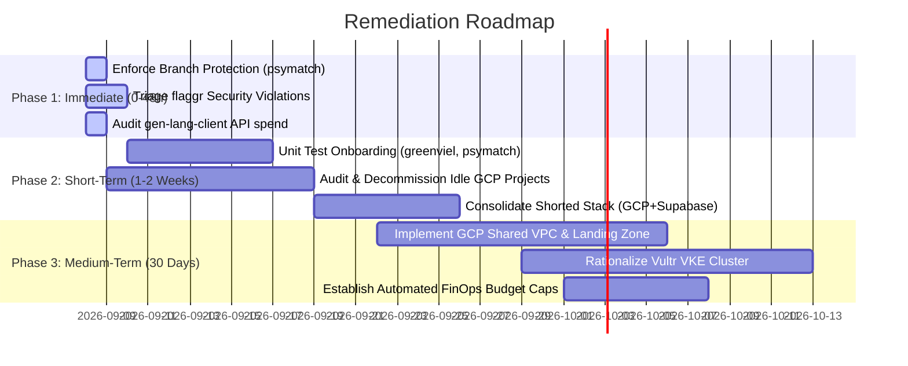

# CloudGuardian Infrastructure & Cost Assessment
**Generated**: $(date -u +"%Y-%m-%dT%H:%M:%SZ")
**Target Org**: mI9dMP4nwuP5cjF5Ap6a (Gamma Systems)
**Execution Mode**: Dry-Run (true)

# Executive Infrastructure & FinOps Assessment Report
**To:** CloudGuardian Executive Leadership & Engineering Steering Committee  
**From:** Lead Cloud Infrastructure & FinOps Architect  
**Date:** September 8, 2026  
**Status:** High-Priority Review  

---

## 1. Executive Summary

An architectural and operational audit of CloudGuardian’s estate reveals significant **multi-cloud sprawl, governance fragmentation, and acute CI/CD quality vulnerabilities**. 

### Key Highlights
* **Active Cloud Footprint (34 Connectors across 5 Providers):**
  * **Google Cloud Platform (GCP):** 30 active projects, heavily consolidated in `australia-southeast2` (Melbourne).
  * **Amazon Web Services (AWS):** 1 active account (`299413881343`) in `ap-southeast-2` (Sydney).
  * **Alternative Clouds & Specialized Platforms:** 1 Vultr Kubernetes Engine cluster (`Vultr VKE`), 1 DigitalOcean Team workspace (`do-My Team`), and 1 Supabase backend instance (`supabase-shorted`).
* **Overall Security & Governance Posture:** **HIGH RISK**. 
  * Uncontrolled sprawl of micro-projects (e.g., 4 discrete projects for `nopass`, 3 for `shorted`, 2 for `cuttlefish`, 2 auto-generated `gen-lang-client-*` projects) indicates the absence of an enterprise Google Cloud Organization / Landing Zone.
  * Quality gates are actively bypassed: production-bound repositories (`psymatch`, `greenviel`) are merging commits with **0.0% test coverage**, while critical platform infrastructure (`flaggr`) operates with **247 active quality and security violations**.
* **FinOps Posture:** **INEFFICIENT**. Redundant operational overhead across five billing platforms, duplicate base infrastructure (NAT gateways, static IPs, control planes, persistent disks), and potential idle/orphaned staging resources in single-tenant GCP projects.

---

## 2. Critical Quality & Vulnerability Hotspots

Recent static analysis and CI coverage telemetry indicate significant technical debt and stability risks within core runtime components.

### Repository Audit Breakdown

| Repository | Active Branch | Latest Commit | Test Coverage | Open Violations | Quality Score | Health Status | Risk Assessment & Impact |
| :--- | :--- | :--- | :--- | :--- | :--- | :---: | :--- |
| **`flaggr`** | `main` | `1f60469` | **29.5%** | **247** *(prev: 282)* | **42 / 100** | ⚠️ **CRITICAL** | **Core Routing Risk:** Feature flagging service deployed to both `flaggr-prod` and `flaggr-478302`. High density of static analysis violations and <30% coverage create extreme blast-radius risk across dependent services. |
| **`psymatch`** | `main` | `93c6517` | **0.0%** | **42** *(stagnant)* | **39 / 100** | ⚠️ **HIGH** | **Active Pipeline Bypass:** High commit velocity directly to `main` (5 commits between Sep 6–8) with zero tests and 42 persistent violations. CI branch protection is either disabled or unenforced. |
| **`greenviel`** | `432/merge` | `f36af49` | **0.0%** | **0** | **60 / 100** | ⚠️ **MODERATE** | **Blind Regression Risk:** High PR velocity (9 merges in 48 hours) with zero static violations, but **0.0% test coverage**. Production changes are rolling out completely unverified by unit or integration tests. |
| **`safelabel`** | `main` | `79721ff` | **0.0%** | **0** | **60 / 100** | 🟡 **MONITOR** | Zero violations, but zero test automation. Coupled to `truelabel-8de39`. |
| **`brandbrain`** | `main` | `87475c9` | **99.8%** | **0** | **100 / 100** | ✅ **BENCHMARK** | **Gold Standard:** Flawless quality score and comprehensive coverage. Should serve as the reference architectural pattern for team CI/CD standards. |

---

## 3. Infrastructure & Cost Opportunities (FinOps Analysis)

### 3.1 Connector Distribution & Redundancy Analysis

1. **Project Sprawl within GCP (30 Projects in Melbourne):**
   * **`nopass` Fragmentation (4 Projects):** Running `nopass-489122`, `nopass-5ab37`, `nopass-business`, and `nopass-e0815`. Multiple fragmented environments create duplicated Cloud NAT gateways, base VPC allocations, IP reservation charges, and log ingest pipelines.
   * **`shorted` Multi-Tier & Split Stack (3 GCP + 1 Supabase):** Divided across `shorted-dev-aba5688f`, `rosy-clover-477102-t5` (prod), `shorted-285201` (legacy), plus `supabase-shorted`. This architecture incurs cross-cloud egress fees and uncoordinated state management.
   * **Unmanaged AI Studio Workspaces (`gen-lang-client-*`):** Two projects (`gen-lang-client-0009130982` and `gen-lang-client-0443779999`) represent auto-generated Gemini API client environments. These represent shadow IT without centralized billing caps, IAM governance, or quota oversight.
   * **Ephemeral / Orphaned Workloads:** Single-purpose projects like `calendar-task-organizer-dev`, `beautiful-home-screen`, `feelingdesigner-d394e`, `sparklife-app`, and `pfinance-app-1748773335` indicate abandoned prototypes or personal testbeds that continue incurring minimum infrastructure baseline fees.

2. **Cross-Cloud Latency & Egress Costs:**
   * Primary GCP infrastructure resides in **Melbourne** (`australia-southeast2`), while AWS is in **Sydney** (`ap-southeast-2`). Inter-cloud networking across these endpoints crosses the public internet or expensive transit partners, adding 12–18ms latency and compounding egress egress egress billing ($0.08–$0.12/GB).

3. **Kubernetes & Container Fragmentation:**
   * Operating **Vultr VKE** alongside GCP suggests workload bifurcation. Maintaining a standalone Kubernetes cluster in Vultr alongside 30 GCP projects incurs unnecessary control plane overhead and duplicate observability pipelines.

### 3.2 FinOps Optimization Targets

| Initiative | Current State | Target Architecture | Estimated Monthly Impact |
| :--- | :--- | :--- | :--- |
| **GCP Project Consolidation** | 30 standalone projects | Unified GCP Organization: Folders for Dev, Staging, Prod with Shared VPCs | **20% – 35% reduction** in idle networking, persistent disk, and base service charges |
| **Decommission Zombie Projects** | Legacy (`shorted-285201`), orphan testbeds | Formal teardown of unmaintained staging/dev sandboxes | **$300 – $1,200/mo** in direct resource reclamation |
| **Vultr VKE Rationalization** | Isolated Kubernetes cluster | Migrate VKE workloads to GCP GKE Autopilot or Cloud Run | Eliminate third-party control plane & egress charges |
| **API & AI Studio Centralization** | 2 `gen-lang-client` projects | Centralized Enterprise Vertex AI / AI Gateway with hard quota alerts | Eliminates shadow spend and unmonitored token overages |

---

## 4. Prioritized Action Plan

### Phase 1: Immediate Remediation (0 – 48 Hours)
- [ ] **Hard Gate CI on `psymatch`:** Immediately enable GitHub/GitLab Branch Protection on `main`. Disallow direct commits without passing test runs and peer review.
- [ ] **Remediate `flaggr` Blocker Violations:** Convene an emergency pairing session on `flaggr` to burn down the top 50 critical violations (security, memory leaks, unhandled exceptions) down from 247.
- [ ] **Lock Down `gen-lang-client` Accounts:** Inspect API credentials in `gen-lang-client-0009130982` and `gen-lang-client-0443779999`. Establish hard billing budgets ($50/day alerting threshold) to prevent runaway billing.

### Phase 2: Short-Term Consolidation (1 – 2 Weeks)
- [ ] **Mandate Test Coverage Thresholds on `greenviel`:** Introduce a baseline test suite requirement (minimum 40% initial threshold, stepping to 80%) before PR merge.
- [ ] **Identify & Suspend Idle Projects:** Conduct an asset inventory on `shorted-285201`, `feelingdesigner-d394e`, `beautiful-home-screen`, and `pfinance-app-1748773335`. Snapshot disks, export configurations, and terminate active compute.
- [ ] **Consolidate `nopass` Environments:** Collapse the 4 disparate `nopass` projects into a single managed project containing namespace-isolated environments (Dev, Staging, Prod).

### Phase 3: Strategic Architectural Alignment (30 – 60 Days)
- [ ] **Deploy Enterprise GCP Landing Zone:** Implement Google Cloud Organization policies, Shared VPCs, and centralized Cloud NAT gateways using Terraform.
- [ ] **Vultr VKE vs. GKE Decision:** Evaluate the cost-to-operate of Vultr VKE against GKE Autopilot / Cloud Run within `australia-southeast2`. If latency or operational overhead exceeds benefits, migrate workloads into GCP.
- [ ] **Adopt `brandbrain` CI/CD Pipeline as Organization Standard:** Extract `brandbrain`'s linting, coverage enforcement, and build configuration into a shared CI template for all CloudGuardian engineering teams.

