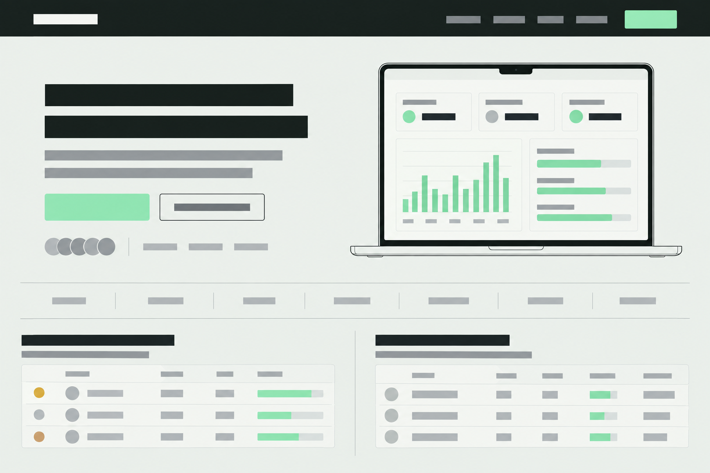
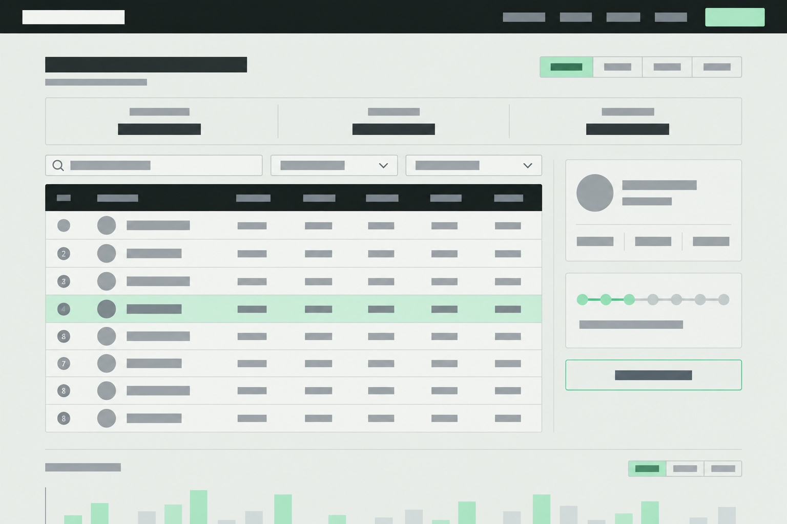
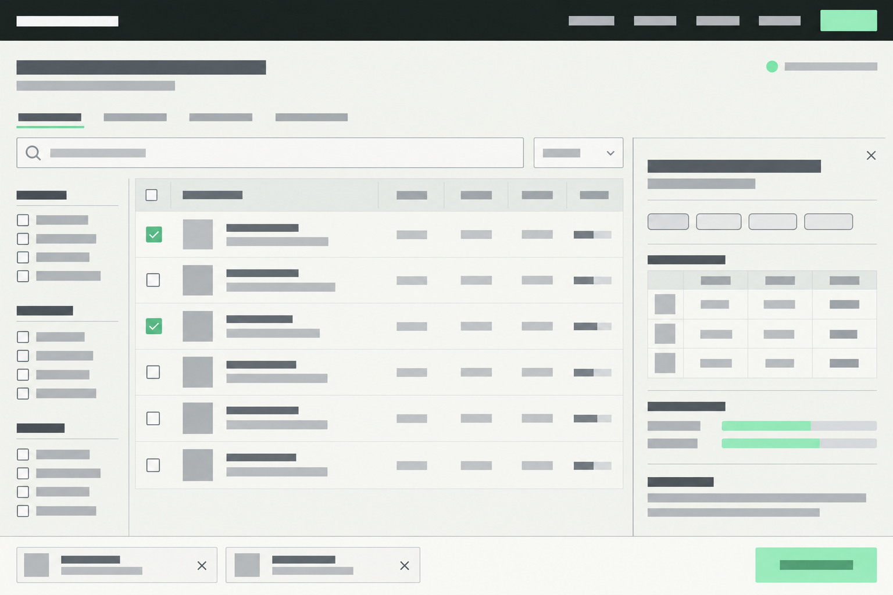

# Token Horizon — proposed public-web redesign

Concept review · 27 September 2026. Three generated desktop wireframes at 1536×1024, chosen to show the first-screen hierarchy and core interactions. This is a design proposal, not an implemented website. No production source or deployed routes were changed.

## Evidence and findings

Reviewed the live root and `/models` in the browser, plus `docs/index.html`, `docs/styles.css`, `docs/leaderboard.html`, `LEADERBOARD.md`, README and the worker routing. The landing page review is based on its repository source; the live root currently presents the leaderboard. No mobile browser or accessibility audit was performed.

1. **The public entrance bypasses the product story.** `cloudflare/src/index.js:1949` rewrites `/` to the leaderboard. A new visitor immediately meets season controls and community analytics. Proposed information architecture: `/` explains and installs the product; `/leaderboard` hosts rankings; `/models` hosts discovery. Preserve legacy profile/share deep links during any routing change.
2. **Rankings are too far down.** At the inspected 1270×714 viewport, the heading, four KPI cards and large league ladder consume almost the entire screen before the first ranking. The current dataset showed one participant, making the seven-tier ladder and empty movement modules particularly dominant. Put the table ahead of league explanation, then progressively reveal supporting analytics.
3. **The model explorer inherits irrelevant controls.** The inspected live `/models` shows dashboard sidebar navigation, season and analytics range, alongside its own search and filters. Local source already expresses flat-route intent (`state.flatModels`, `th-flat`), so investigate deployment/route presentation drift before rebuilding that behavior. Do not assume the current source and deployment are identical.
4. **Price and score meaning need to be visible at the point of comparison.** Main-list headings abbreviate price as In/Out and display SWE, Used and Value. The detail drawer already explains prices per million tokens; carry those units into the list. Define community usage scope and score methodology. Unavailable scores remain unavailable.
5. **The landing source splits attention.** Nine navigation items, an install command and three hero actions compete; installation instructions recur in two sections. Keep one primary install path and a secondary product preview, then link community and model discovery through meaningful previews.
6. **Privacy copy needs qualification.** The landing source says “no cloud database,” while optional community publishing uses cloud storage. Proposed wording: “Usage tracking stays on your device. Publish a community profile only when you choose.” Describe the actual sharing controls nearby; do not imply that optional publication is local-only.

## Shared direction

Flat, front-on wireframes: graphite #101714 navigation, warm ivory #E9EEE8 canvas, mint #A9E8BC for selection/action, neutral skeleton bars, restrained rules and clear spacing. No people or invented brand marks. Retain the existing Token Horizon name and black-hole identity when building; the blank brand placeholder is not a proposed replacement logo. A production dark theme can use the same hierarchy.

The images deliberately use copy placeholders. Any incidental generated numerals, people counts, avatars, charts or ranks are illustrative, not observed statistics. These are static layout concepts, not loading-state designs. The landing laptop is an imagined product demonstration, not a current app screenshot. Its small circles should become factual capability markers, not fabricated customer social proof.

## 1. Landing page

- **Job:** help a developer understand the utility and install it confidently.
- **Header:** Token Horizon, Models, Leaderboard, Docs, GitHub, Install. Keep the shared public navigation across all three surfaces.
- **Hero:** proposed headline “Know where your AI usage goes.” Supporting copy names tokens, costs and plan limits. Primary action: Install for macOS. Secondary: See it in action. Show supported platform and local tracking facts beneath.
- **Proof:** an accurate notch interaction preview with tokens, model/provider usage and quota resets. Label demo data when using a simulated preview.
- **Below hero:** provider compatibility strip; two editorial previews linking to the leaderboard and model explorer; one installation section with alternate methods; explicit local-versus-public privacy explanation.
- **Small screens:** copy and install action first, preview second; navigation collapses; commands scroll or wrap within their container with a labeled Copy action.

## 2. Leaderboard

- **Job:** find a participant, compare activity over a clear period, and open their profile.
- **Top:** heading plus Today / 7 days / All time / Streak control. Use consistent period definitions across visible totals and rows; label lifetime-only metrics separately.
- **Summary:** three compact measures, for example period tokens, active participants and requests. Missing data is shown as unavailable, not zero.
- **Primary table:** rank, person/team, tokens, requests, trend and streak; league as a compact identity badge. Input/output, cost and efficiency remain available in expanded detail, optional columns or profile views.
- **Right rail:** personal standing only when an authenticated/linked identity is established; otherwise a join/publish explanation. A compact league track links to league details. Do not mark the first public entry as “You” for an anonymous visitor.
- **Below rankings:** usage chart and movement only when supported by sufficient history. With one participant, render that actual row and an invitation; never fill the production table with fictional peers. No claims that usage volume measures work quality.
- **Small screens:** hide the rail behind a standing/league disclosure; retain rank, person and tokens; expose other metrics on row expansion. Never shrink a 13-column table to fit a phone.

## 3. Model explorer

- **Job:** find a suitable model, understand the available listings, and compare price and capability.
- **Top:** Models heading and actual catalog update time; Explorer / Cheapest / Providers / Plans tabs. Retain existing deep links and canonical route behavior.
- **Search:** one dominant search field, result count, sort, visible active filters and Clear filters. Relevance order stays authoritative during search.
- **Filters:** provider, capability and deployment/license scopes from catalog metadata. Keep “primary listings” deduplication on by default, with a clear count and reveal control for alternatives.
- **Table:** model, input USD/1M tokens, output USD/1M tokens, benchmark with source, optional community adoption with scope. Format unknown, zero/free, plan-covered and unavailable prices distinctly. Plan-covered entries show “Included in plan”; never invent a per-token price for them.
- **Detail drawer:** context/capabilities, provider listing comparison, benchmark provenance and adoption. “From” prices always identify the provider and applicable conditions.
- **Proposed addition:** selecting up to three models creates a comparison tray. This is new interface work, not a claim about current behavior. Build from existing exported fields; omit absent comparisons rather than deriving unsupported metrics.
- **Small screens:** filter sheet, compact model rows, full-width detail view and comparison action showing selection count. Preserve search/filter state when closing details.

## Implementation sequence and constraints

1. Reconcile deployed public routing with the intended landing and flat model routes. Preserve `/u/`, `/s/`, legacy query links and sign-in return paths. Route changes are a separate implementation/deployment step.
2. Establish shared public header, type hierarchy, spacing and theme tokens. Keep dashboard tools within their operating context.
3. Reorder leaderboard content and handle anonymous, sparse, empty, loading, stale and failed states explicitly.
4. Improve model list units, filter hierarchy and drawer. Add comparison as a bounded feature only after the existing explorer remains fast and stable.
5. Refine landing copy, real product proof, install flow and privacy explanation.

Preserve the app-exported catalog, curated plans, vendored Fuse/chart/avatar bundles, client-side search and deduplication, model/provider deep links, windowed rows with matching CSS/JS heights, chart-host pooling, request deduplication and unchanged-data render suppression. Do not add provider fetches to the browser, hand-edit `docs/data/models.json`, change analytics formulas or expose prompt titles. No new dependency is required by these concepts.

Before shipping: verify keyboard access, visible focus, semantic table/control labels, contrast, reduced motion, drawer focus restoration, 390px and wide desktop layouts, long model/provider names, zero results, API failures, catalog freshness and each existing deep link. Those checks have not been performed on an implementation because this deliverable contains concepts only.

## Files

All three images are 1536×1024 lossless WebP conversions of generated PNG originals. `manifest.json` contains filenames, alt text and the complete generation prompts, including the identical style prefix. The ZIP includes this review and that manifest.
